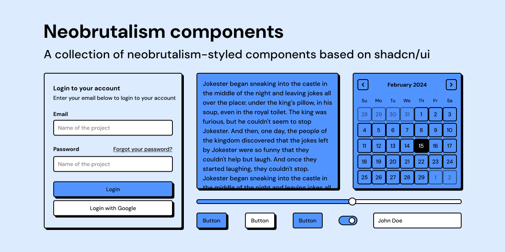

# Shadcn Component Liabrary Starter

<!--  -->

## Introduction

Component Liabrary Starter is a starter for creating component libraries with [React](https://reactjs.org/) and [Tailwind CSS](https://tailwindcss.com/). 

## Documentation

Visit [docs](https://docsurl.yourtld) to get started.

## About 

I created this collection of components for people who want to get started with creating pre-styled component with shadcn/ui
## License

[MIT](https://github.com/nalonix/shadcn-component-lib-starter/blob/main/LICENSE)
